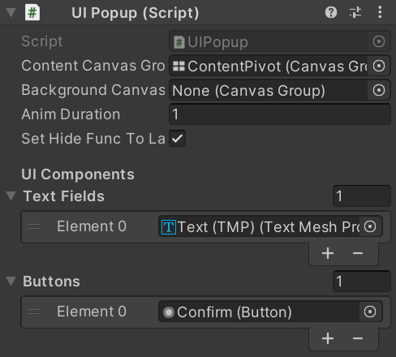

## 목적

디자이너와 개발자의 협업과 Unity상 Scene 충돌 방지를 최소화하기 위함. 더불어, 사용자에게 친화적인 인터페이스를 제공함.

## 구성

### UIView

``UIView``는 Scene내에서 일시적으로 보여지는 한 화면 단위 개념. 모든 UIView는 Playmode 진입 시, 화면에서 사라진 상태 (Hide)에서 시작하고 부모 캔버스의 정중앙 위치로 이동하는 초기화 과정을 거침.

더불어, UIView는 CanvasGroup를 Component로 갖고 있어야 함. 해당 UIView에서 작동되는 기능들은 UIView를 상속 받은 클래스로 구현하여 작성할 것을 권장.

```csharp
public class ExampleView : UIView
{
    [Header("Login Form")]
    [SerializeField] private TMP_InputField _idInputField;
    [SerializeField] private Button _loginButton;

    protected override void Start()
    {
        base.Start();
    }

    private void OnClickLogin()
    {
        if (_idInputField.text == string.Empty)
        {
            UIPopup.GetUIPopup("SingleWarningPopup")
                .SetDependencyOnView(this)
                .SetText("Username이 빈 값입니다. 올바르게 입력해주세요.", "OK")
                .Show().Forget();
            return;
        }

        PlayerPrefs.SetString(MyRoomConst.PLAYER_ID, _idInputField.text);
        SplashManager.Instance.JoinMyRoom();
    }

    protected override void OnHide()
    {
        // 해당 UIView의 Animation Duration이 0이면, 애니메이션 없이 바로 Hide가 실행되므로, OnHide에서 이벤트 삭제를 검토한다.
        if (_loginButton.onClick.GetPersistentEventCount() > 0)
            _loginButton.onClick.RemoveListener(OnClickLogin);
    }

    protected override void OnHiding()
    {
        _loginButton.onClick.RemoveListener(OnClickLogin);
    }

    protected override void OnShow()
    {
        _loginButton.onClick.AddListener(OnClickLogin);
    }
}    
```

UIView에는 ``UITransitionBase`` (Animation과 관련된 스크립트)가 항상 함께 존재하며, 별도 Component 할당이 없다면 UITransitionFadeInOut을 자동 할당하여 Fade In/Out 처리함.

### UINavigation

``UINavigation``을 통해, Scene내 View를 제어하며, 사용자가 접근한 View들의 히스토리를 추적함. 이에 따라, 사용자는 *이전 화면으로 돌아가기* 등의 기능을 수행할 수 있음.

### UIViewContainer

``UIViewContainer``는 ``UINavigation``의 동작을 입력 받아, 화면에 보여줄 UIView를 현재 Scene내에서 수집하고, 반환하는 역할을 수행함.

### UIContextManager

``UIContextManager``는 Scene 단위로 UI를 관리하기 위한 Behaviour 스크립트. Scene 전환 시, ``UINavigation``, ``UIViewContainer``를 Dispose하여, 다음 Scene에서 초기화를 진행할 수 있는 상태로 만들어 놓음.

### UIPopup

``UIPopup``은 UIView보다 상단의 UI이기 때문에, 별도의 Popup 전용 Canvas를 사용할 것을 권장. 

UIPopup에는 크게 Popup content 영역과 Background 영역으로 나눠 구성할 것을 권장하며, 이들은 모두 CanvasGroup 컴포넌트를 갖고 있어야 함. 만약, Background가 필요하지 않는 Popup Prefab에는 Background를 만들 필요는 없음.

지정된 Popup content 영역과 Background에는 UIView와 동일하게 ``UITransitionBase``가 필요하며, 없다면 런타임에 동적으로 UITransitionFadeInOut이 부착됨.



UIPopup 내, **UI Components** 항목의 데이터 (기본 Text, Button)를 Binding 할
수 있도록 기능을 제공. 제공되는 확장 메소드를 통해, 아래와 같이 Text 내용과 Button에 이벤트를 제공할 수 있음.

```csharp
// UIPopup을 호출하는 일반 스크립트나 UIView 스크립트

var popUp = UIPopup.GetUIPopup("DoubleButtonPopup");

    popUp.SetText("다음 가이드를 보시겠습니까?", "네, 볼래요!", "아니요, 안 볼래요!") // 팝업 내용, Confirm 버튼, Cancel 버튼
        .SetDependencyOnView(UINavigation.CurrentView) // 해당 UIView에 Lifecycle에 따름 (Hide시, Hide됨)
        .SetButtonEvent(async () =>
        {
            await popUp.Hide(); // Confirm 버튼 이벤트. 해당 Popup을 Hide하고, 다음 UIView를 보여줌.
            UINavigation.PushUIView(guideViewObject.transform.parent.GetChild(nextGameObjectIndex).name);
        }, async () => 
        {
            await popUp.Hide()) // Cancel 버튼 이벤트. 해당 Popup만 Hide함.
        }
        .Show().Forget();
```

### UIPopupContainer

``UIPopupContainer``는 UIPopup Prefab을 관리하는 Behaviour 스크립트로, Popup Canvas에 부착해야 함. 해당 Scene에서 보여줄 UI Prefab들을 인스펙터에 할당시켜 정의할 수 있으며, UIPopup에서 요청 시 동적으로 생성하여 제공함.

### UITransitionBase

``UITransitionBase``는 UIView, UIPopup에서 사용될 Component이며, CanvasGroup Component를 필요로 함. 애니메이션은 DOTween을 사용을 권장하지만, 직접 만들어도 무방.

```csharp
public class ExampleTransition : UITransitionBase
{
    private Tween tween;

    protected override UniTask HideAnim(float duration)
    {
        // Hide시, Animation
    }

    protected override void HideWithoutAnim()
    {
        // Animation 없이 Hide (duration이 0이거나, 최초 Init에 사용됨)
    }

    protected override void KillAnim()
    {
        // Animation 중단
        if (tween.active) tween.Kill(true)
    }

    protected override UniTask ShowAnim(float duration)
    {
        // Show시, Animation
    }

    protected override void ShowWithoutAnim()
    {
        // Animation 없이 Show (duration이 0인 경우, 사용됨)
    }
}
```

현재 구현된 UITransition 목록

- UITransitionFadeInOut : Fade In/OuT
- UITransitionSlide : Slide (왼쪽, 위, 오른쪽, 아래)
- UITransitionFadeSlide : Fade In/Out + Slide

## 예제

*UINavigationTestScene 참고*

- UINavigationTestScene와 같이, UIView를 Prefab으로 만들 필요는 없음. UINavigation은 Scene내 UIView만 수집함 (디자인과 실제 개발을 분리하기 위해 Prefab화).

